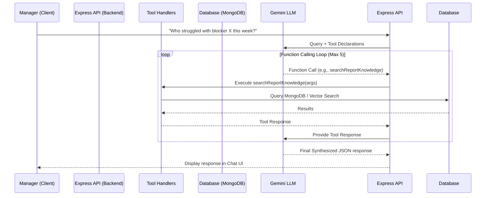

# AI Architecture & Integration

## Overview
InsightLoop incorporates an intelligent "Manager Assistant" powered by Google's Gemini Pro LLM (`@google/genai`). This feature allows managers to query their team's data using natural language, providing deeper, contextual insights that go beyond standard dashboard charts.

## System Flow (Agentic Function Calling)

The system utilizes an agent-based loop where the LLM can actively query the backend for more data using predefined tools.

## Implementation Details
- **Provider**: Google Gemini API via the official `@google/genai` Node.js SDK.
- **Agentic Loop**: The `GeminiService` implements a `while` loop to handle up to 5 consecutive tool calls before forcing a final answer.
- **Available Tools**:
  - `getTeamSummary`: Aggregates metrics, blockers, and achievements for a specific week.
  - `getProjectInsights`: Retrieves detailed insights for a specific project.
  - `searchReportKnowledge`: Performs semantic vector search on historical reports (RAG).
- **Structured Output**: The LLM is forced to return structured data via `responseSchema` and `responseMimeType: 'application/json'`, ensuring the frontend can reliably parse and render the output.
