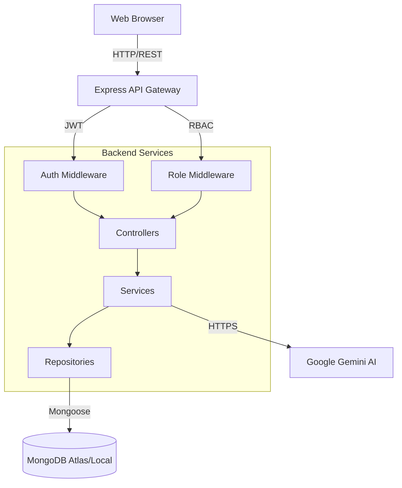

# System Architecture

## Overview
InsightLoop is a monolithic full-stack web application with a clear separation of concerns between the React frontend (Single Page Application) and the Node.js/Express backend (REST API).

## High-Level Architecture

## Frontend Architecture
- **Framework**: Vite + React 19
- **Routing**: React Router (Client-side routing with protected routes)
- **State Management**: TanStack Query (React Query) for server state caching, invalidation, and data fetching.
- **Styling**: Tailwind CSS with shadcn/ui components for a highly consistent and professional design system.
- **Features**: Grouped by domain (e.g., `features/dashboard`, `features/reports`) rather than by technical function.

## Backend Architecture
- **Framework**: Node.js + Express
- **Pattern**: Controller-Service-Repository (CSR)
  - **Controllers**: Handle HTTP requests/responses, extract parameters.
  - **Services**: Contain pure business logic (e.g., status transition validations, metrics calculation).
  - **Repositories**: Abstract database operations (Mongoose queries).
- **Security**: JWT tokens stored in HTTP-Only cookies to prevent XSS. Strict RBAC middleware applied per-route.

## Trade-offs & Decisions
1. **Monolith vs Microservices**: A monolithic approach was chosen for simplicity of deployment and cognitive load, given the scoped requirements of a team dashboard.
2. **MongoDB (NoSQL) vs SQL**: MongoDB was chosen for its flexibility with document schemas (like the `snapshot` field in `ReportVersion`, which stores mixed data).
3. **Server-Side Filtering**: Dashboard filters rely on backend aggregation pipelines rather than client-side filtering to support scalability and large datasets.
