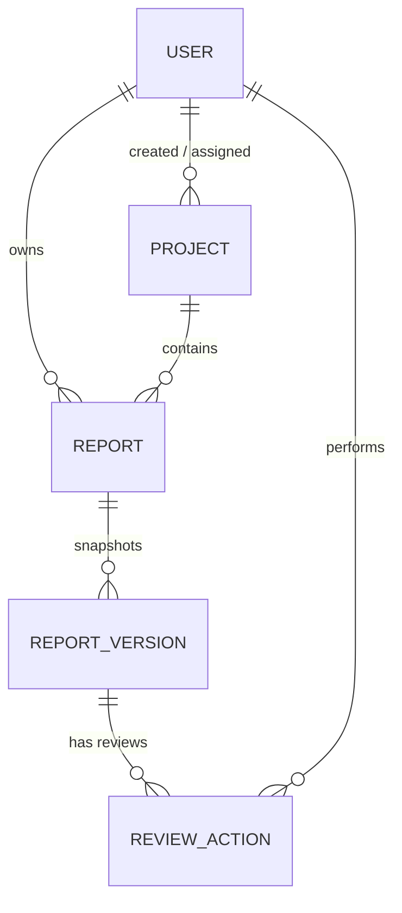

# Database Design

## Overview
InsightLoop uses MongoDB as its primary datastore, leveraged via Mongoose ODM. The schema is designed to handle hierarchical RBAC, strict versioning for reports, and comprehensive review auditing.

## ER Diagram (Conceptual)

## Collections & Schemas

### 1. Users
Stores all user information, authentication hashes, and roles.
- `firstName`, `lastName`, `email` (unique)
- `passwordHash`
- `role`: Enum (`ADMIN`, `MANAGER`, `TEAM_MEMBER`)
- `isActive`: Boolean

### 2. Projects
Represents the organizational units of work.
- `name`, `description`, `type`
- `createdBy`: Ref `User`
- `assignedMembers`: Array of Refs to `User`

### 3. Reports
The core business entity representing a weekly submission.
- `owner`: Ref `User`
- `weekStart`, `weekEnd`: Date range
- `project`: Ref `Project`
- `tasksCompleted`: Array of `ITask` subdocuments
- `nextWeekTasks`: Array of `ITask` subdocuments
- `blockers`, `achievements`: Subdocuments
- `currentStatus`: Enum (`DRAFT`, `SUBMITTED`, `NEEDS_CORRECTION`, `APPROVED`)
- `currentVersion`: Integer (increments on post-correction resubmissions)
- *Indexes*: `{owner: 1, weekStart: 1}` (Unique) for data integrity.

### 4. ReportVersions
Immutable snapshots of a report at the time of submission.
- `reportId`: Ref `Report`
- `versionNumber`: Integer
- `snapshot`: Mixed (Complete copy of the report state)
- `submittedBy`: Ref `User`
- `statusAtSubmission`: String
- *Indexes*: `{reportId: 1, versionNumber: 1}` (Unique) ensuring strict sequential versioning.

### 5. ReviewActions
Audit trail of manager interactions (approvals, change requests).
- `reportId`: Ref `Report`
- `reportVersionId`: Ref `ReportVersion`
- `reviewerId`: Ref `User` (Manager/Admin)
- `action`: Enum (`APPROVED`, `CHANGES_REQUESTED`)
- `comment`: String
