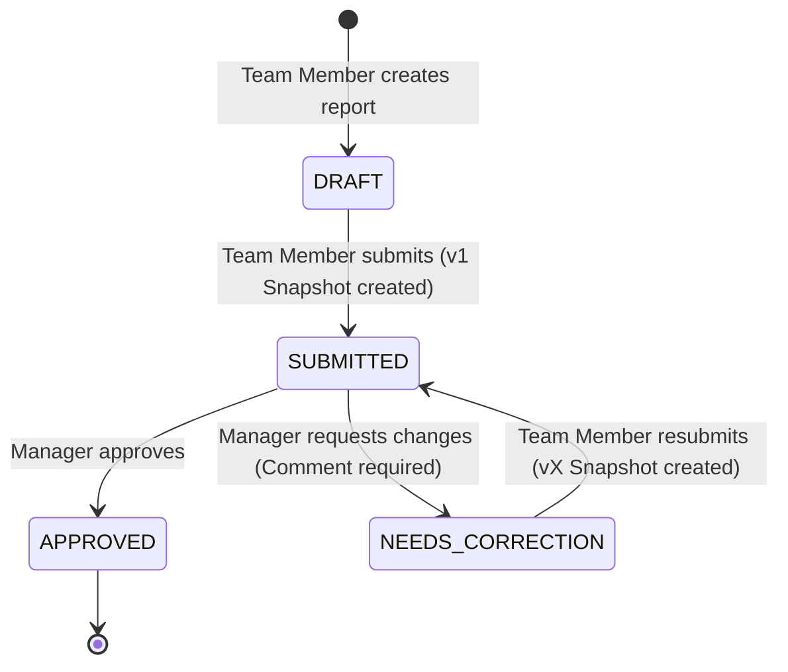

# Report Review Workflow

## Overview
The report review workflow is the core business process of InsightLoop, ensuring accountability, proper feedback loops, and immutable version history for team reports.

## State Machine

## Technical Implementation

### Version Incrementing Logic
A critical requirement of the system is maintaining an immutable audit trail without duplicate key collisions.

1. **Initial Submission**:
   - `Report.currentVersion` is `1`.
   - The user clicks Submit.
   - A `ReportVersion` snapshot is created with `versionNumber = 1`.
   - `Report.currentStatus` updates to `SUBMITTED`.

2. **Manager Review**:
   - Manager clicks "Request Changes".
   - A mandatory comment is provided.
   - A `ReviewAction` is recorded linking the manager, the report, and the specific version.
   - `Report.currentStatus` updates to `NEEDS_CORRECTION`.

3. **Correction & Resubmission**:
   - The team member edits the report and clicks Submit again.
   - The system detects the transition from `NEEDS_CORRECTION` to `SUBMITTED`.
   - **Critical Step**: The system calculates `newVersion = currentVersion + 1`.
   - A new `ReportVersion` snapshot is created with `versionNumber = newVersion`.
   - `Report` is updated to reflect the new `currentVersion` and `SUBMITTED` status.

This ensures the unique index `{ reportId: 1, versionNumber: 1 }` on the `ReportVersion` collection is never violated.
